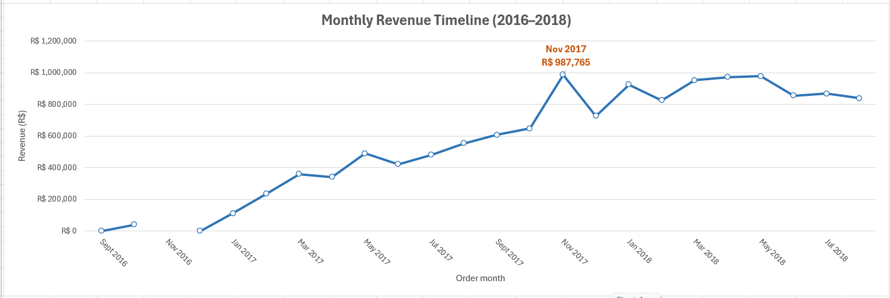
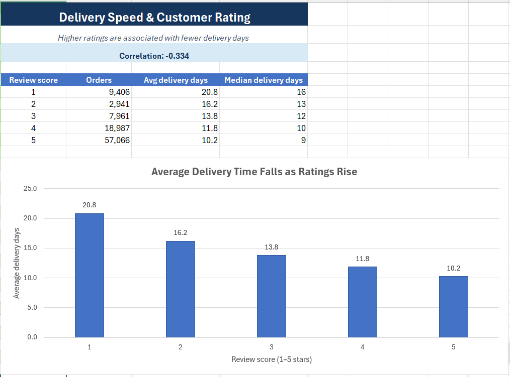
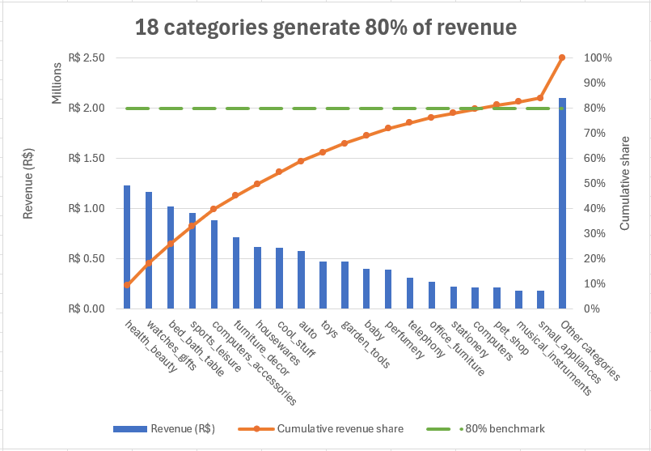

## Olist Business Hypotheses Analysis

### Hypothesis 1: Orders placed during certain months generate more revenue

#### Business Question
**Is there seasonal variation in sales?**

#### Observation
- Olist was founded in 2015, resulting in relatively low sales volumes during its early months.
- Sales grew steadily throughout 2017, indicating increasing platform adoption and customer demand.
- The highest monthly revenue was recorded in **November 2017**, reaching **R$987,765**.

#### Key Drivers Behind the November 2017 Revenue Surge
1. Black November and Black Friday

Brazilian consumers have strongly embraced Black Friday shopping. Retailers have expanded the event into a month-long promotion known as Black November. Many consumers deliberately delay large purchases such as electronics, home appliances, and furniture to capitalize on these discounts.

2. First Installment of the 13th Salary

Brazilian labor law requires employers to pay the first half of the mandatory 13th-month salary bonus by 30 November. This injects significant additional income into the economy just as Black Friday promotions begin, increasing consumers' purchasing power and stimulating retail spending.

#### Conclusion

The data suggests a strong seasonal effect, with November significantly outperforming other months. However, there are insufficient data points in 2018 to establish whether this pattern continued beyond the observed period.

---

### Hypothesis 2: Orders with late deliveries receive lower review scores

#### Business Question

**Would shortened delivery times improve customer ratings?**

#### Observation

Analysis of customer review scores against delivery times reveals a correlation coefficient of **-0.334**.

For a dataset of approximately **96,000 orders**, this relationship is statistically significant.

|Review Score	|Orders	|Average Delivery Days	|Median Delivery Days|
|-------------- |-----	|-----------------------|--------------------|
|1	|9,406	|20.8	|16|
|2	|2,941	|16.2	|13|
|3	|7,961	|13.8	|12|
|4	|18,987	|11.8	|10|
|5	|57,066	|10.2	|9|
---

#### Key Findings
Customers awarding 1-star reviews waited an average of 20.8 days.
Customers awarding 5-star reviews waited an average of 10.2 days.
Average delivery times consistently decrease as customer ratings increase.
Faster deliveries are associated with higher satisfaction levels.

#### Conclusion
The negative correlation indicates that delivery speed has a measurable influence on customer satisfaction. Improvements in logistics and fulfillment efficiency are likely to increase customer ratings and overall customer experience.

---

### Hypothesis 3: A small number of product categories account for a large share of revenue

#### Business Question

Which categories perform best, and which should be promoted or expanded?

#### Observation
Health & Beauty was the highest-performing category, generating R$1,233,131 in revenue.
The top 18 categories contributed approximately 80% of total revenue.
Key Findings

The revenue distribution closely follows the Pareto Principle (80/20 rule):

A relatively small number of categories generate the majority of revenue.
High-performing categories include:
Health & Beauty
Watches & Gifts
Bed & Bath Table
Sports & Leisure
Computers & Accessories

#### Conclusion

The concentration of revenue among a limited number of categories suggests that Olist should prioritize:

Marketing investment in top-performing categories.
Expansion of inventory and supplier partnerships within these categories.
Cross-selling and upselling opportunities around proven revenue drivers.

By focusing resources on the categories responsible for most revenue, Olist can maximize growth and profitability while maintaining a data-driven product strategy.

#### Executive Summary
|Hypothesis	|Result	|Key Insight|
|-----------|-------|-----------|
|Orders placed during certain months generate more revenue	|✅ Supported	|November 2017 reached a record R$987,765, driven by Black November promotions and 13th salary payments.|
|Orders with late deliveries receive lower review scores	|✅ Supported	|Customer ratings decrease as delivery times increase. Correlation coefficient = -0.334.|
|A small number of product categories account for a large share of revenue	|✅ Supported	|Top 18 categories generate 80% of revenue, with Health & Beauty contributing the most.|